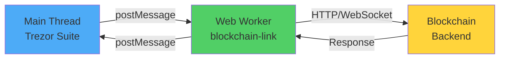

The `@trezor/blockchain-link` package provides a unified client interface for multiple blockchain backend implementations. It abstracts the differences between various blockchain APIs, allowing Trezor Suite to interact with different networks through a consistent interface.

## Overview

`blockchain-link` is the bridge between Trezor Suite and various blockchain backends. It handles:

- Blockchain connectivity and communication
- Transaction fetching and broadcasting
- Account balance and history queries
- Block and mempool monitoring
- WebSocket connections for real-time updates

## Supported Backends

<CardGroup cols={2}>
  <Card title="Blockbook" icon="server">
    **Maintained by:** SatoshiLabs
    
    **Networks:** Bitcoin-like and Ethereum-like
    
    **Features:** Full history, UTXO tracking, mempool monitoring
    
    [Blockbook on GitHub](https://github.com/trezor/blockbook)
  </Card>

  <Card title="Electrum" icon="bolt">
    **Maintained by:** Third parties
    
    **Networks:** Bitcoin network
    
    **Features:** Lightweight, wide server availability
    
    [Electrum Protocol Docs](https://electrumx-spesmilo.readthedocs.io/)
  </Card>

  <Card title="Ripple" icon="diamond">
    **Maintained by:** Ripple/XRP Ledger Foundation
    
    **Networks:** Ripple (XRP)
    
    **Features:** Native XRP Ledger support
    
    [XRP Ledger Docs](https://xrpl.org/)
  </Card>

  <Card title="Blockfrost" icon="cube">
    **Maintained by:** Blockfrost.io
    
    **Networks:** Cardano (ADA)
    
    **Features:** Cardano-specific functionality
    
    [Blockfrost Docs](https://blockfrost.io)
  </Card>
</CardGroup>

## Installation

Install the package in your project:

```bash
yarn add @trezor/blockchain-link
```

## Basic Usage

### Initializing a Connection

```javascript
import BlockchainLink from '@trezor/blockchain-link';
import Blockbook from '@trezor/blockchain-link/lib/workers/blockbook';

const link = new BlockchainLink({
    name: 'Bitcoin',                    // Name used in logs
    worker: Blockbook,                  // Worker implementation
    server: [
        'https://btc1.trezor.io',       // Primary server
        'https://btc2.trezor.io',       // Fallback server
    ],
    debug: true,                        // Enable debug logging
});
```

### Fetching Blockchain Info

```javascript
try {
    const info = await link.getInfo();
    console.log('Block height:', info.blockHeight);
    console.log('Block hash:', info.blockHash);
} catch (error) {
    console.error('Failed to get blockchain info:', error);
}
```

### Getting Account Information

```javascript
const account = await link.getAccountInfo({
    descriptor: 'xpub6D...',  // Account descriptor (xpub, address, etc.)
    details: 'txs',           // Include transaction details
});

console.log('Balance:', account.balance);
console.log('Transactions:', account.history.total);
```

### Subscribing to Block Updates

```javascript
// Subscribe to new blocks
await link.subscribe({
    type: 'block',
});

// Listen for block events
link.on('block', (block) => {
    console.log('New block:', block.height);
});
```

## Architecture

### Worker-Based Design

Blockchain-link uses Web Workers to handle network communication without blocking the main thread:



### Key Components

<AccordionGroup>
  <Accordion title="BlockchainLink Class">
    The main class that:
    - Manages worker lifecycle
    - Handles message passing between main thread and worker
    - Provides the public API
    - Manages event subscriptions
    - Implements request throttling
  </Accordion>

  <Accordion title="Workers">
    Each backend has a dedicated worker implementation:
    - `workers/blockbook/index.ts` - Blockbook backend
    - `workers/electrum/index.ts` - Electrum backend
    - `workers/ripple/index.ts` - Ripple backend
    - `workers/blockfrost/index.ts` - Blockfrost backend
    
    Workers handle:
    - Network communication
    - Response parsing
    - WebSocket management
    - Error handling
  </Accordion>

  <Accordion title="Type Definitions">
    Shared types in `@trezor/blockchain-link-types`:
    - Request/response types
    - Event types
    - Backend-specific types
    - Error definitions
  </Accordion>

  <Accordion title="Utilities">
    Helper functions in `@trezor/blockchain-link-utils`:
    - Response transformers
    - Data validators
    - Common utilities
  </Accordion>
</AccordionGroup>

## Worker Implementation

### Using Workers in Different Environments

#### Web (with Webpack)

```javascript
import BlockbookWorker from 'worker-loader?filename=workers/blockbook-worker.[hash].js!@trezor/blockchain-link/lib/workers/blockbook/index.js';

const link = new BlockchainLink({
    worker: BlockbookWorker,
    // ... other options
});
```

#### Web (with URL)

```javascript
const link = new BlockchainLink({
    worker: './workers/blockbook-worker.js',
    // ... other options
});
```

#### Node.js (without Workers)

```javascript
const link = new BlockchainLink({
    worker: () => import('@trezor/blockchain-link/lib/workers/blockbook'),
    // ... other options
});
```

## API Reference

### Methods

<AccordionGroup>
  <Accordion title="connect()">
    Establishes connection to the blockchain backend.
    
    ```typescript
    await link.connect();
    ```
  </Accordion>

  <Accordion title="disconnect()">
    Closes the connection and cleans up resources.
    
    ```typescript
    await link.disconnect();
    ```
  </Accordion>

  <Accordion title="getInfo()">
    Gets current blockchain info (block height, hash, etc.).
    
    ```typescript
    const info = await link.getInfo();
    // { blockHeight: 750000, blockHash: '0x...', ... }
    ```
  </Accordion>

  <Accordion title="getAccountInfo(request)">
    Fetches account information including balance and history.
    
    ```typescript
    const account = await link.getAccountInfo({
        descriptor: 'xpub6D...',
        details: 'txs',
        page: 1,
        pageSize: 25,
    });
    ```
  </Accordion>

  <Accordion title="getTransaction(txid)">
    Gets details of a specific transaction.
    
    ```typescript
    const tx = await link.getTransaction('abc123...');
    ```
  </Accordion>

  <Accordion title="pushTransaction(tx)">
    Broadcasts a signed transaction to the network.
    
    ```typescript
    const result = await link.pushTransaction('0100000...');
    // Returns transaction ID
    ```
  </Accordion>

  <Accordion title="estimateFee(blocks)">
    Estimates transaction fee for confirmation within N blocks.
    
    ```typescript
    const fees = await link.estimateFee({ blocks: [1, 3, 6] });
    // { 1: 20, 3: 15, 6: 10 } // sat/byte
    ```
  </Accordion>

  <Accordion title="subscribe(subscription)">
    Subscribes to blockchain events (blocks, addresses, etc.).
    
    ```typescript
    await link.subscribe({
        type: 'block',
    });
    
    await link.subscribe({
        type: 'addresses',
        addresses: ['1A1zP1...', '3J98t1...'],
    });
    ```
  </Accordion>

  <Accordion title="unsubscribe(subscription)">
    Unsubscribes from blockchain events.
    
    ```typescript
    await link.unsubscribe({ type: 'block' });
    ```
  </Accordion>
</AccordionGroup>

### Events

Listen to events using the EventEmitter pattern:

```typescript
// New block mined
link.on('block', (block) => {
    console.log('Block:', block.height, block.hash);
});

// Transaction affecting subscribed address
link.on('notification', (notification) => {
    console.log('Address activity:', notification);
});

// Connection status changed
link.on('connected', () => {
    console.log('Connected to blockchain backend');
});

link.on('disconnected', () => {
    console.log('Disconnected from blockchain backend');
});

// Error occurred
link.on('error', (error) => {
    console.error('Blockchain-link error:', error);
});
```

## Development

### Running the Development UI

Blockchain-link includes a testing UI:

```bash
# With Web Workers support
yarn workspace @trezor/blockchain-link dev

# Without Web Workers (bundle mode)
yarn workspace @trezor/blockchain-link dev:module
```

### Running Tests

```bash
# Unit tests
yarn workspace @trezor/blockchain-link test:unit

# Type checking
yarn workspace @trezor/blockchain-link type-check

# Linting
yarn workspace @trezor/blockchain-link lint
```

### Integration Tests

```bash
# Build first
yarn workspace @trezor/blockchain-link build:lib
yarn workspace @trezor/blockchain-link build:workers

# Run integration tests
yarn workspace @trezor/blockchain-link test:integration
```

## Configuration Options

<ResponseField name="name" type="string" required>
  Name used in debug logs to identify this instance
</ResponseField>

<ResponseField name="worker" type="Worker | string | function" required>
  Worker implementation or path to worker script
</ResponseField>

<ResponseField name="server" type="string | string[]" required>
  Backend server URL(s). Multiple URLs provide fallback support
</ResponseField>

<ResponseField name="debug" type="boolean" default="false">
  Enable debug logging
</ResponseField>

<ResponseField name="timeout" type="number" default="30000">
  Connection timeout in milliseconds
</ResponseField>

<ResponseField name="throttleBlockEvent" type="number" default="500">
  Throttle block events to prevent overwhelming the UI (in ms)
</ResponseField>

## Related Packages

<CardGroup cols={3}>
  <Card title="blockchain-link-types" icon="file-code">
    TypeScript type definitions
  </Card>

  <Card title="blockchain-link-utils" icon="toolbox">
    Utility functions and helpers
  </Card>

  <Card title="websocket-client" icon="plug">
    WebSocket client implementation
  </Card>
</CardGroup>

## Best Practices

<AccordionGroup>
  <Accordion title="Always Handle Errors">
    Network requests can fail. Always wrap API calls in try-catch blocks:
    
    ```typescript
    try {
        const info = await link.getInfo();
    } catch (error) {
        // Handle connection errors, timeouts, etc.
        console.error('Failed to get blockchain info:', error);
    }
    ```
  </Accordion>

  <Accordion title="Use Multiple Servers">
    Provide fallback servers for reliability:
    
    ```typescript
    const link = new BlockchainLink({
        server: [
            'https://btc1.trezor.io',
            'https://btc2.trezor.io',
            'https://btc3.trezor.io',
        ],
    });
    ```
  </Accordion>

  <Accordion title="Clean Up Subscriptions">
    Unsubscribe when no longer needed to prevent memory leaks:
    
    ```typescript
    // Subscribe
    await link.subscribe({ type: 'block' });
    
    // Later, when component unmounts
    await link.unsubscribe({ type: 'block' });
    link.removeAllListeners();
    ```
  </Accordion>

  <Accordion title="Throttle Block Events">
    Use the `throttleBlockEvent` option to prevent UI performance issues during rapid block updates:
    
    ```typescript
    const link = new BlockchainLink({
        throttleBlockEvent: 1000, // Max 1 event per second
    });
    ```
  </Accordion>
</AccordionGroup>

## Next Steps

<CardGroup cols={2}>
  <Card title="Package Overview" href="/development/packages/overview" icon="boxes-stacked">
    Explore all packages in the monorepo
  </Card>

  <Card title="Utilities" href="/development/packages/utilities" icon="toolbox">
    Learn about utility packages
  </Card>

  <Card title="Connect Package" href="/connect/overview" icon="plug">
    Explore the Connect package documentation
  </Card>

  <Card title="Common Tasks" href="/development/common-tasks" icon="list-check">
    Development workflows and troubleshooting
  </Card>
</CardGroup>
