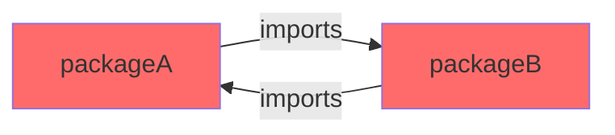
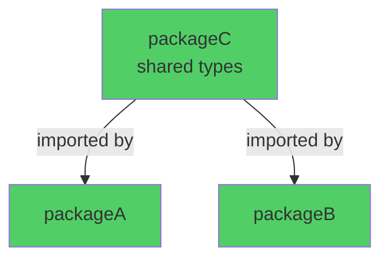

This guide explains how to create new packages in the Trezor Suite monorepo and follow best practices for package organization.

## Quick Start

Use the package generator to create a new package:

```bash
yarn generate-package @scope/new-package-name
```

The generator will create a package boilerplate in the appropriate folder based on the scope.

### Example

```bash
yarn generate-package @suite-common/wallet
```

This creates a package in the `/suite-common/wallet` folder.

## Understanding Package Scopes

Choose the correct scope based on what your package does and what it needs to import:

<CardGroup cols={2}>
  <Card title="@trezor/*" icon="cube">
    **Location:** `/packages`
    
    **Use for:** Public packages used by Suite and third parties
    
    **Can import:** Nothing from other scopes
    
    **Examples:** `@trezor/connect`, `@trezor/utils`
  </Card>

  <Card title="@suite-common" icon="share-nodes">
    **Location:** `/suite-common`
    
    **Use for:** Code shared between web/desktop and mobile Suite
    
    **Can import:** `@trezor/*` only
    
    **Examples:** Wallet logic, shared state management
  </Card>

  <Card title="@suite-native" icon="mobile">
    **Location:** `/suite-native`
    
    **Use for:** Mobile Suite (React Native)
    
    **Can import:** `@trezor/*`, `@suite-common`
    
    **Examples:** Mobile-specific UI, native integrations
  </Card>

  <Card title="@suite" icon="desktop">
    **Location:** `/suite`
    
    **Use for:** Desktop and web Suite
    
    **Can import:** `@trezor/*`, `@suite-common`
    
    **Examples:** Web-specific features, desktop integrations
  </Card>
</CardGroup>

## Using Your New Package

After creating a package, follow these steps to use it:

<Steps>
  <Step title="Add to Dependencies">
    Add the package to the `dependencies` field in `package.json` of the consuming package:
    
    ```json package.json
    {
      "dependencies": {
        "@scope/new-package-name": "workspace:*"
      }
    }
    ```
  </Step>

  <Step title="Generate TypeScript References">
    Run the refs command to generate tsconfig references:
    
    ```bash
    yarn refs
    ```
  </Step>

  <Step title="Install Dependencies">
    Run yarn to let it symlink the package:
    
    ```bash
    yarn
    ```
  </Step>

  <Step title="Import and Use">
    Import the package in your code:
    
    ```typescript
    import { something } from '@scope/new-package-name';
    ```
  </Step>
</Steps>

## Package Design Best Practices

### Smaller is Better

Creating smaller packages helps avoid cyclic dependencies and improves maintainability.

<Warning>
**Avoid This Pattern:**

1. Create `packageA` with type `FormInput` and multiple forms
2. Import `FormInput` from `packageA` into `packageB`
3. Try to import form from `packageB` back into `packageA`
4. Get cyclic dependency error

This forces you to either merge packages (creating a monolith) or refactor.
</Warning>

<Tip>
**Better Approach:**

Create `packageC` containing shared types like `FormInput`. Both `packageA` and `packageB` import from `packageC`, avoiding circular dependencies.
</Tip>

### Benefits of Smaller Packages

<CardGroup cols={2}>
  <Card title="Avoid Cyclic Dependencies" icon="arrows-rotate">
    Smaller packages reduce the chance of circular import issues.
  </Card>

  <Card title="Better Control" icon="sliders">
    Fine-grained control over what other packages can use.
  </Card>

  <Card title="Faster Testing" icon="rocket">
    Run smaller subsets of tests and lints for faster feedback.
  </Card>

  <Card title="Clear Purpose" icon="bullseye">
    Each package has a well-defined, focused responsibility.
  </Card>
</CardGroup>

## Package Structure

A typical package structure looks like:

```
@scope/package-name/
├── src/
│   ├── index.ts          # Main entry point
│   ├── types.ts          # Type definitions
│   └── ...
├── tests/
│   └── *.test.ts         # Tests
├── package.json          # Package configuration
├── tsconfig.json         # TypeScript config
├── README.md             # Documentation
└── CHANGELOG.md          # Version history
```

## Package Configuration

### package.json

Key fields in your `package.json`:

```json package.json
{
  "name": "@scope/package-name",
  "version": "1.0.0",
  "private": true,  // or false for published packages
  "main": "./lib/index.js",
  "types": "./lib/index.d.ts",
  "scripts": {
    "build": "yarn build:lib",
    "build:lib": "tsc",
    "test": "jest",
    "lint": "eslint .",
    "type-check": "tsc --noEmit"
  },
  "dependencies": {},
  "devDependencies": {}
}
```

### TypeScript Configuration

Your `tsconfig.json` should extend the root configuration:

```json tsconfig.json
{
  "extends": "../../tsconfig.json",
  "compilerOptions": {
    "outDir": "./lib",
    "rootDir": "./src",
    "composite": true
  },
  "include": ["src/**/*"],
  "references": [
    // Generated by yarn refs
  ]
}
```

## Preventing Cyclic Dependencies

### The Problem

Cyclic dependencies occur when:



### The Solution

Extract shared code into a separate package:



### Respect Scope Boundaries

<Steps>
  <Step title="@trezor packages">
    Cannot import from any other scope. Keep them independent and reusable.
  </Step>

  <Step title="@suite-common packages">
    Can only import from `@trezor/*`. No Suite-specific or native dependencies.
  </Step>

  <Step title="@suite and @suite-native packages">
    Can import from `@trezor/*` and `@suite-common`, but not from each other.
  </Step>
</Steps>

## Testing Your Package

After creating a package, ensure it works correctly:

```bash
# Type checking
yarn workspace @scope/package-name type-check

# Linting
yarn workspace @scope/package-name lint

# Unit tests
yarn workspace @scope/package-name test

# Build
yarn workspace @scope/package-name build
```

## Common Pitfalls

<Warning>
**Don't create packages that are too large**

Large packages like the original `packages/suite` lead to cyclic dependency issues and become difficult to maintain.
</Warning>

<Warning>
**Don't violate scope boundaries**

Importing from unauthorized scopes breaks the architecture. The build system will enforce these rules.
</Warning>

<Warning>
**Don't duplicate code instead of creating shared packages**

If multiple packages need the same utility, create a shared package rather than copying code.
</Warning>

## Examples

### Creating a Utility Package

```bash
# Create in @trezor scope (no dependencies on other scopes)
yarn generate-package @trezor/validation-utils
```

### Creating a Shared State Package

```bash
# Create in @suite-common (shared between web and mobile)
yarn generate-package @suite-common/wallet-state
```

### Creating a Platform-Specific Package

```bash
# For web/desktop
yarn generate-package @suite/desktop-native-bindings

# For mobile
yarn generate-package @suite-native/biometrics
```

## Next Steps

<CardGroup cols={2}>
  <Card title="Package Overview" href="/development/packages/overview" icon="boxes-stacked">
    Browse all packages in the monorepo
  </Card>

  <Card title="Common Tasks" href="/development/common-tasks" icon="list-check">
    Learn about dependency management and troubleshooting
  </Card>

  <Card title="TypeScript Guide" href="/development/typescript" icon="code">
    TypeScript conventions and best practices
  </Card>

  <Card title="Testing" href="/development/testing" icon="flask">
    How to write tests for your package
  </Card>
</CardGroup>
