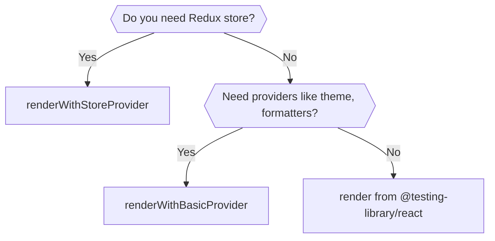

Trezor Suite uses comprehensive testing strategies to ensure code quality and reliability. This guide covers unit testing, integration testing, and end-to-end testing practices.

## Running Tests

<Tabs>
  <Tab title="Unit Tests">
    ```bash
    # Run all unit tests
    yarn test:unit

    # Test specific package
    yarn workspace @trezor/suite-common test:unit

    # Run single test file
    yarn workspace @trezor/suite-common test:unit --coverage=0 file.test.ts
    ```
  </Tab>
  <Tab title="E2E Tests">
    ```bash
    # Run Playwright E2E tests
    yarn suite:e2e:playwright

    # Run specific test
    yarn suite:e2e:playwright --grep "dashboard"
    ```
  </Tab>
  <Tab title="Type Check">
    ```bash
    # Check TypeScript types (10-15 minutes)
    yarn type-check
    ```
  </Tab>
</Tabs>

## Test Structure and Organization

### File Naming and Location

<Steps>
  <Step title="Test files">
    Place tests in `__tests__` folders with `.test.ts` extension:
    ```
    my-module/
    └── src/
        ├── __tests__/
        │   └── utils.test.ts
        └── utils.ts
    ```
  </Step>
  
  <Step title="Type tests">
    Use `.type-test.ts` suffix to prevent Jest execution:
    ```
    packages/utils/tests/typedObjectFromEntries.type-test.ts
    ```
  </Step>
  
  <Step title="Mocks and fixtures">
    Place in `mocks` folder at package root with `mock` prefix:
    ```
    my-module/
    ├── mocks/
    │   ├── mockDevice.ts
    │   └── index.ts
    └── src/
        └── device.ts
    ```
  </Step>
</Steps>

<Warning>
Test folder must be in the same directory as the implementation, not in a separate root `tests/` folder.
</Warning>

## Writing Unit Tests

### Using @suite/test-utils

Trezor Suite provides custom test utilities for React component testing:



### Basic Component Testing

<Tabs>
  <Tab title="Without Redux">
    ```tsx
    import { renderWithBasicProvider, screen, userEvent } from '@suite/test-utils';

    describe('Counter', () => {
        it('should start with 0 value', () => {
            renderWithBasicProvider(<Counter />);

            expect(screen.getByLabelText('Counter value')).toHaveTextContent('0');
        });

        it('should increment value on button press', async () => {
            renderWithBasicProvider(<Counter />);
            const user = userEvent.setup();

            await user.click(screen.getByText('+'));

            expect(screen.getByLabelText('Counter value')).toHaveTextContent('1');
        });
    });
    ```
  </Tab>
  <Tab title="With Redux Store">
    ```tsx
    import { renderWithStoreProvider, screen, type PreloadedState } from '@suite/test-utils';

    describe('AccountSelector', () => {
        const renderAccountSelector = (preloadedState: PreloadedState) =>
            renderWithStoreProvider(<AccountSelector />, { preloadedState });

        it('should display account balance', () => {
            const preloadedState: PreloadedState = {
                wallet: {
                    accounts: [{ id: '1', balance: '1.5', symbol: 'btc' }],
                },
            };

            renderAccountSelector(preloadedState);

            expect(screen.getByText('1.5 BTC')).toBeInTheDocument();
        });
    });
    ```
  </Tab>
  <Tab title="With Store Access">
    ```tsx
    import {
        renderWithStoreProvider,
        screen,
        initStoreForTests,
        act,
        type TestStore,
    } from '@suite/test-utils';

    describe('Counter', () => {
        let store: TestStore;

        beforeEach(() => {
            ({ store } = initStoreForTests({ counter: { value: 0 } }));
        });

        it('should react to state changes', () => {
            renderWithStoreProvider(<Counter />, { store });

            act(() => {
                store.dispatch({ type: 'counter/increment' });
            });

            expect(screen.getByLabelText('Counter value')).toHaveTextContent('1');
            expect(store.getState().counter.value).toBe(1);
        });
    });
    ```
  </Tab>
</Tabs>

### Testing Hooks

<Tabs>
  <Tab title="Without Providers">
    ```tsx
    import { renderHook, act } from '@suite/test-utils';

    describe('useCounter', () => {
        it('should increment count', () => {
            const { result } = renderHook(() => useCounter());

            act(() => {
                result.current.increment();
            });

            expect(result.current.count).toBe(1);
        });
    });
    ```
  </Tab>
  <Tab title="With Providers">
    ```tsx
    import { renderHookWithBasicProvider } from '@suite/test-utils';

    describe('useFormattedBalance', () => {
        it('should format balance correctly', () => {
            const { result } = renderHookWithBasicProvider(
                () => useFormattedBalance('1.5', 'BTC')
            );

            expect(result.current).toBe('1.50000000 BTC');
        });
    });
    ```
  </Tab>
  <Tab title="With Redux">
    ```tsx
    import {
        renderHookWithStoreProvider,
        initStoreForTests,
        type TestStore,
    } from '@suite/test-utils';

    describe('useSelectedAccount', () => {
        let store: TestStore;

        beforeEach(() => {
            ({ store } = initStoreForTests({
                wallet: { selectedAccount: 'account-1' },
            }));
        });

        it('should return selected account', () => {
            const { result } = renderHookWithStoreProvider(
                () => useSelectedAccount(),
                { store }
            );

            expect(result.current?.id).toBe('account-1');
        });
    });
    ```
  </Tab>
</Tabs>

## Best Practices

### Avoid Testing Implementation Details

<Check>Test behavior, not implementation.</Check>

<Tabs>
  <Tab title="Good - Testing behavior">
    ```tsx
    it('should show success message after form submission', async () => {
        renderWithBasicProvider(<LoginForm />);
        const user = userEvent.setup();

        await user.type(screen.getByLabelText(/email/i), 'test@example.com');
        await user.type(screen.getByLabelText(/password/i), 'password123');
        await user.click(screen.getByRole('button', { name: /submit/i }));

        expect(screen.getByText('Login successful')).toBeInTheDocument();
    });
    ```
  </Tab>
  <Tab title="Bad - Testing implementation">
    ```tsx
    it('should call handleSubmit when form is submitted', () => {
        const handleSubmit = jest.fn();
        render(<LoginForm onSubmit={handleSubmit} />);

        // Testing internal implementation details
        const form = screen.getByTestId('login-form');
        fireEvent.submit(form);

        expect(handleSubmit).toHaveBeenCalled();
    });
    ```
  </Tab>
</Tabs>

<Info>
Learn more: [Testing Implementation Details](https://kentcdodds.com/blog/testing-implementation-details)
</Info>

### Use userEvent Over fireEvent

<Warning>`userEvent` simulates real user interactions more accurately than `fireEvent`.</Warning>

<Tabs>
  <Tab title="Good - userEvent">
    ```tsx
    import { renderWithBasicProvider, userEvent, screen } from '@suite/test-utils';

    const user = userEvent.setup();
    await user.click(screen.getByRole('button'));
    await user.type(screen.getByLabelText('Email'), 'test@example.com');
    ```
  </Tab>
  <Tab title="Bad - fireEvent">
    ```tsx
    import { renderWithBasicProvider, fireEvent, screen } from '@suite/test-utils';

    fireEvent.click(screen.getByRole('button'));
    fireEvent.change(screen.getByLabelText('Email'), { target: { value: 'test@example.com' } });
    ```
  </Tab>
</Tabs>

### Prefer getByRole for Queries

<Check>Use `getByRole` to encourage accessible components.</Check>

```tsx Priority order
// Best - Semantic and accessible
screen.getByRole('button', { name: /submit/i });

// Good - Accessible
screen.getByLabelText('Email address');

// OK - For text content
screen.getByText('Welcome back');

// Last resort - Avoid if possible
screen.getByTestId('submit-button');
```

### Handle Translations in Tests

<Warning>
Text can change with Crowdin syncs. Use translation IDs instead of literal strings.
</Warning>

<Tabs>
  <Tab title="Good">
    ```tsx
    expect(screen.getByText(getTranslation('path.to.translation'))).toBeTruthy();

    // When text must not change:
    expect(screen.getByText(getTranslation('path.to.translation'))).toBe(
        'I want a developer to check this important text if it is changed in Crowdin.',
    );
    ```
  </Tab>
  <Tab title="Bad">
    ```tsx
    expect(
        screen.getByText('This can change with a Crowdin sync and someone will have to fix the test.'),
    ).toBeTruthy();
    ```
  </Tab>
</Tabs>

### Wait for Async Operations

<Tip>Always use `waitFor` when testing asynchronous behavior.</Tip>

```tsx
import { renderWithBasicProvider, waitFor, screen, userEvent } from '@suite/test-utils';

it('should load data on mount', async () => {
    renderWithBasicProvider(<DataComponent />);
    const user = userEvent.setup();

    await user.click(screen.getByRole('button', { name: /load/i }));

    await waitFor(() => {
        expect(screen.getByText('Data loaded')).toBeInTheDocument();
    });
});
```

## Mocks and Fixtures

### Typing Mocks

<Warning>All mocks must be fully typed. Using `as` to cast incomplete objects is a last resort.</Warning>

<Tabs>
  <Tab title="Good - Typed factory">
    ```tsx
    import { Device } from '@trezor/connect';

    export const mockDevice = (override?: Partial<Device>): Device => ({
        id: 'device-1',
        path: '/device/path',
        label: 'My Trezor',
        features: {
            vendor: 'trezor.io',
            major_version: 2,
            minor_version: 0,
            patch_version: 0,
            // ... all required fields
        },
        ...override,
    });
    ```
  </Tab>
  <Tab title="Bad - Incomplete cast">
    ```tsx
    export const mockDevice = {
        id: 'device-1',
        path: '/device/path',
    } as Device; // Missing required fields!
    ```
  </Tab>
</Tabs>

### Mock Organization

<Steps>
  <Step title="Location">
    Place mocks in the same package where the type declaration resides:
    ```
    device-types/
    ├── mocks/
    │   ├── mockDevice.ts
    │   └── index.ts
    └── src/
        └── device.ts
    ```
  </Step>
  
  <Step title="Naming">
    Use `mock` prefix: `Device` → `mockDevice`
  </Step>
  
  <Step title="Factory pattern">
    Prefer factories over static objects:
    ```tsx
    mockDevice(data: Partial<Device>): Device => ({ ... })
    ```
  </Step>
  
  <Step title="Export">
    Export from package via separate entry:
    ```tsx
    import { mockDevice } from '@common/device-types/mocks';
    ```
  </Step>
</Steps>

### Mock Reusability

<Warning>Keep shared mocks generic and non-opinionated.</Warning>

**Simple test:** Changes in shared mocks should NOT break existing tests (or make fixes trivial).

## Common Testing Patterns

### Testing Forms

```tsx
import { renderWithBasicProvider, screen, userEvent, waitFor } from '@suite/test-utils';

describe('LoginForm', () => {
    it('should submit form with valid data', async () => {
        const onSubmit = jest.fn();
        const user = userEvent.setup();

        renderWithBasicProvider(<LoginForm onSubmit={onSubmit} />);

        await user.type(screen.getByLabelText(/email/i), 'test@example.com');
        await user.type(screen.getByLabelText(/password/i), 'password123');
        await user.click(screen.getByRole('button', { name: /submit/i }));

        await waitFor(() => {
            expect(onSubmit).toHaveBeenCalledWith({
                email: 'test@example.com',
                password: 'password123',
            });
        });
    });

    it('should show validation errors', async () => {
        const user = userEvent.setup();

        renderWithBasicProvider(<LoginForm />);

        await user.click(screen.getByRole('button', { name: /submit/i }));

        expect(screen.getByText('Email is required')).toBeInTheDocument();
        expect(screen.getByText('Password is required')).toBeInTheDocument();
    });
});
```

### Testing Async Actions

```tsx
import { renderWithStoreProvider, initStoreForTests, waitFor } from '@suite/test-utils';

describe('fetchAccountData', () => {
    it('should fetch and store account data', async () => {
        const { store } = initStoreForTests();

        store.dispatch(fetchAccountData('account-1'));

        await waitFor(() => {
            const state = store.getState();
            expect(state.wallet.accounts).toHaveLength(1);
            expect(state.wallet.accounts[0].id).toBe('account-1');
        });
    });
});
```

### Testing Error States

```tsx
import { renderWithBasicProvider, screen } from '@suite/test-utils';

describe('DataComponent', () => {
    it('should display error message on fetch failure', async () => {
        const mockFetch = jest.fn().mockRejectedValue(new Error('Network error'));

        renderWithBasicProvider(<DataComponent fetchData={mockFetch} />);

        await waitFor(() => {
            expect(screen.getByRole('alert')).toHaveTextContent('Failed to load data');
        });
    });
});
```

## End-to-End Testing

<Info>
Trezor Suite uses Playwright for E2E testing. See the full [E2E guide](https://github.com/trezor/trezor-suite/tree/develop/suite/e2e/docs) for details.
</Info>

### E2E Best Practices

<Steps>
  <Step title="Use page objects">
    Organize selectors and actions in page object classes
  </Step>
  <Step title="Tag tests appropriately">
    Use `@group-name` tags for test organization
  </Step>
  <Step title="Handle retries">
    Configure retries for flaky tests
  </Step>
  <Step title="Use proper locators">
    Prefer data-testid over CSS selectors
  </Step>
</Steps>

## Test Coverage

<Tip>Aim for meaningful coverage, not 100% coverage.</Tip>

```bash
# Generate coverage report
yarn test:unit --coverage

# View coverage report
open coverage/lcov-report/index.html
```

**Focus on:**
- Critical user paths
- Complex business logic
- Error handling
- Edge cases

**Don't focus on:**
- Simple getters/setters
- Third-party library wrappers
- Configuration files

## Debugging Tests

<AccordionGroup>
  <Accordion title="Debug single test">
    ```bash
    # Add .only to run single test
    it.only('should do something', () => {
        // Test code
    });

    # Or use --testNamePattern
    yarn test:unit --testNamePattern="should do something"
    ```
  </Accordion>
  
  <Accordion title="Debug in VS Code">
    Add to `.vscode/launch.json`:
    ```json
    {
        "type": "node",
        "request": "launch",
        "name": "Jest Debug",
        "program": "${workspaceFolder}/node_modules/.bin/jest",
        "args": ["--runInBand", "--coverage=0"],
        "console": "integratedTerminal"
    }
    ```
  </Accordion>
  
  <Accordion title="View component state">
    ```tsx
    import { screen, debug } from '@suite/test-utils';

    // Print entire DOM
    screen.debug();

    // Print specific element
    screen.debug(screen.getByRole('button'));
    ```
  </Accordion>
</AccordionGroup>

## Resources

<CardGroup cols={2}>
  <Card title="Testing Library" icon="book-open" href="https://testing-library.com/docs/react-testing-library/intro">
    Official Testing Library docs
  </Card>
  <Card title="Jest Documentation" icon="flask" href="https://jestjs.io/docs/getting-started">
    Jest testing framework
  </Card>
  <Card title="Playwright E2E" icon="play" href="https://playwright.dev/">
    End-to-end testing with Playwright
  </Card>
  <Card title="Kent C. Dodds Blog" icon="newspaper" href="https://kentcdodds.com/blog">
    Testing best practices and tips
  </Card>
</CardGroup>
